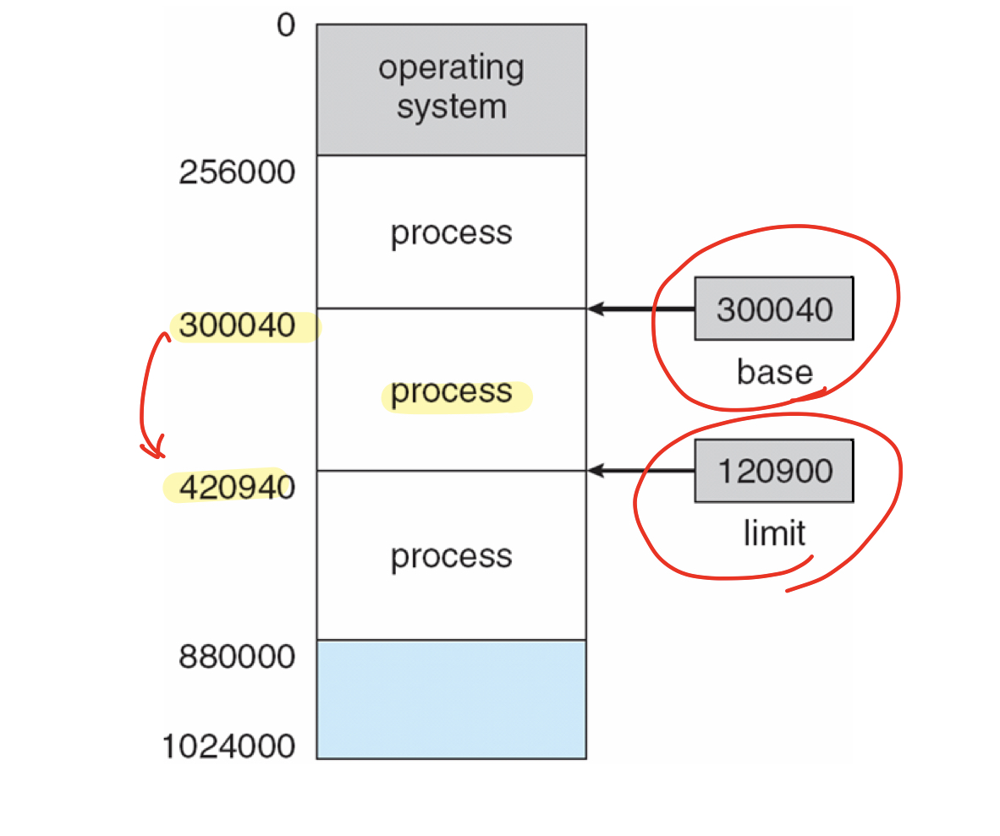
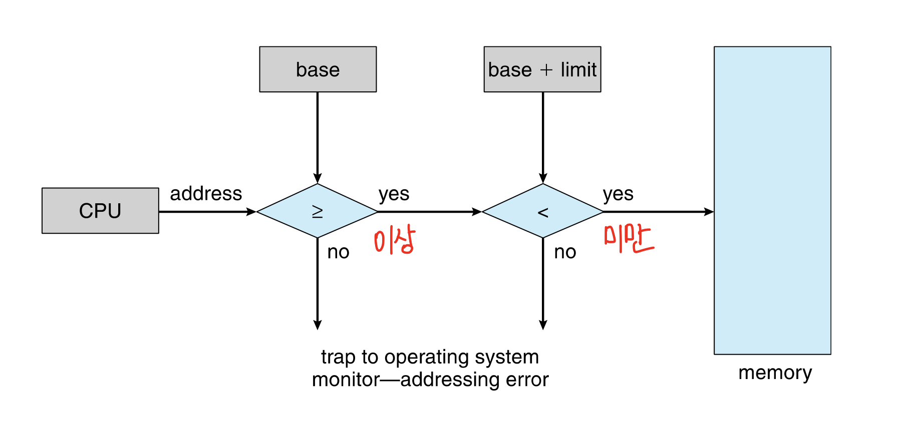
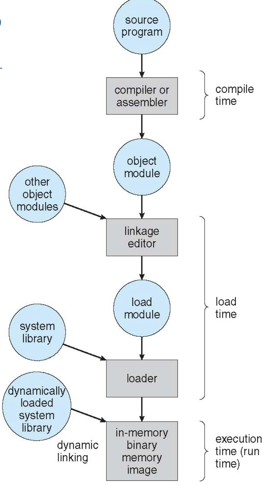
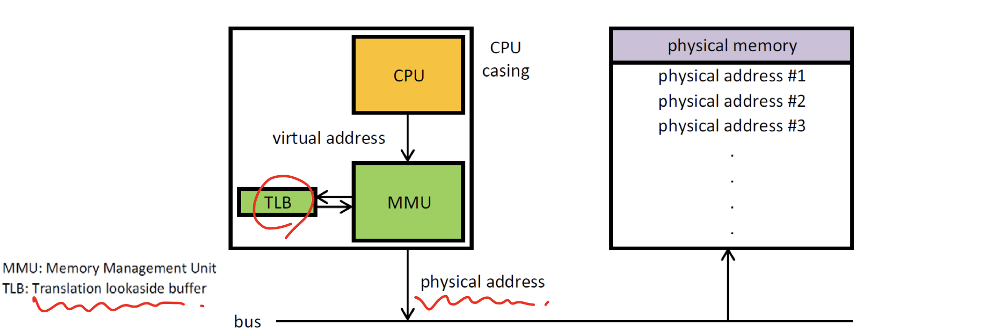
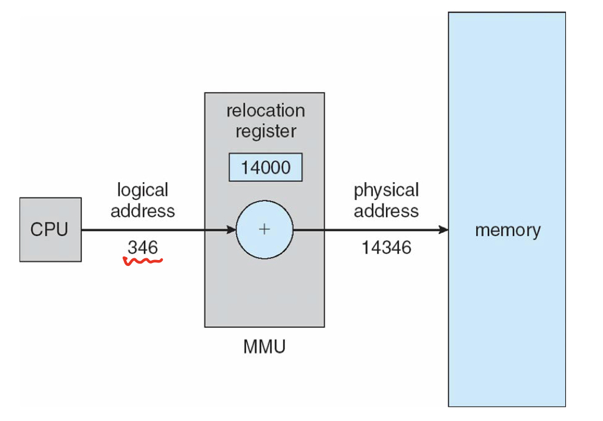

# Chapter 8: Memory management

## Contents
- 배경
- Swapping 
- Contiguous Memory Allocation
- Segmentation
- Paging
- Structure of the Page table

## Objectives
- 하드웨어의 메모리를 조직하는 다양한 방법
- 다양한 Memory management 기술(페이징, 세그멘테이션)

## Background
- 프로그램이 실행이 되려면 하드디스크로부터 프로그램을 메모리로 불어와야 한다.
- 메인메모리는 cpu가 접근할 수 있는 유일한 저장공간이다.
- 메모리 유닛 -> address + read request 또는 address + data and write request 의 스트림을 본다.
- 레지스터 접근은 1개의 cpu clock 또는 이하의 시간이 걸림
- 메인 메모리 접근은 많은 사이클 소요 -> stall 발생.
- 캐시는 메인 메모리와 cpu 레지스터 사이에 있다.
- 메모리를 보호하려면 올바른 동작을 하는지 확실해야한다. 

## Base and Limit Registers
- Base Limit pair 가 논리적인 주소 공간을 정의한다.
- CPU는 유저 모드에서 발생한 모든 메모리 접근이 base와 limit 사이에 있는지 확인해야한다.

## Hardware Address Protection

base 주소값 이상, base + limit 미만인 주소인지 확인해야함.

## Address Binding 

주소 바인딩이 필요한 이유를 살펴보자. 
- 하드디스크 상의 프로그램은 메모리에 로딩이 되기 전에 input queue에서 scheduling을 대기한다. 
- user process의 physical 시작 주소를 항상 0000으로 할 수 없다. 여러 유저 프로세스가 동일한 메모리 주소를 가져서 충돌이 발생할 수 있고 시작주소 0000 은 interrupt vector table등이 위치하는 경우가 많다.
- 프로그램이 어느 시점에 어디 존재하는지에 따라 주소가 다르게 표현이 된다.
  - 소스코드의 주소 : Symbolic address 당연히 숫자가 아닌 심볼형태 변수로 표시된다.
  - Compiled 코드의 주소 : relocatable address에 바인드됨. 컴파일러에서 이 심볼형태의 주소를 재배치가 가능한 주소(상대적인 주소 : 이 모듈의 첫번째 바이트로부터 열네번째 바이트)로 바인딩을 시킨다. 
  - 링커와 로더 : 재배치가능주소 (relocatable address)를 절대주소(absolute address)로 바인딩한다.

## Binding of Instructions and Data to Memory
- 명령어와 데이터의 주소바인딩은 서로 다른 스테이지에서 일어날 수 있다.
  - 컴파일타임에 일어나는 주소 바인딩 (compile time) : 컴파일 시점에 해당 프로세스가 들어갈 특정 주소 정보를 알고있는 경우세 컴파일된 코드가 특정 주소부터 시작되도록 할 수 있음.
  - 링크타임에 일어나는 주소 바인딩 (link time) : dynamic or static
  - 로드타임에 일어나는 주소 바인딩 (load time) : 컴파일러가 Relocatable code 만듦 실제 심볼 및 진짜 주소와의 바인딩은 프로그램이 메인메모리에 실제 로딩이 될 때 이루어짐.  
  - 실행타임에 일어나는 주소 바인딩 (execution time) : 만약 프로세스가 실행되는 중간에 메모리 내의 한 세그먼트에서 다른 세그먼트로 옮겨질 수 있는 경우, 바인딩이 실행시간에 이루어진다고 함. 실행시점에서 바인딩이 이뤄지려면 특별한 하드웨어가 있어야 함.
 

 ## Local vs Physical Address Space

logical address 공간은 physical address space의 메모리 관리를 위함이다. 
- logical address : cpu에 의해 발생. 가상주소라고도 하기도 함.
- physical address : 메모리 유닛의 주소

- logical, physical 주소 같다 : compile time 그리고 load time 주소 바인딩에서
- 다르다 : execution-time 주소 바인딩에서

## MMU(Memory-Management Unit)

- 하드웨어 장치는 런타임에 가상주소와 physical 주소를 매핑한다.
- **user process 가상 주소 + relocation register value(address) (Base register의 값) => Physical address**
- 유저프로그램에서는 논리주소로만 하지, 진짜 물리적인 주소를 보여주지는 않는다. 실행타임에 바인딩이 되어서 실제 메모리에 대한 레퍼런스가 만들어진다. 

## Dynamic relocation using a relocation register
- 루틴은 call될때만 로드가 된다. -> 메모리 공간 사용을 더 효율적으로 할 수 있음
- 모든 루틴은 relocatable load format으로 디스크에 있다.
- 사이즈가 큰 코드가 필요할때 유용하다. 
- os의 특별한 서포트가 필요하지 않다. 프로그램 디자인으로 실행될 수 있으므로. 

