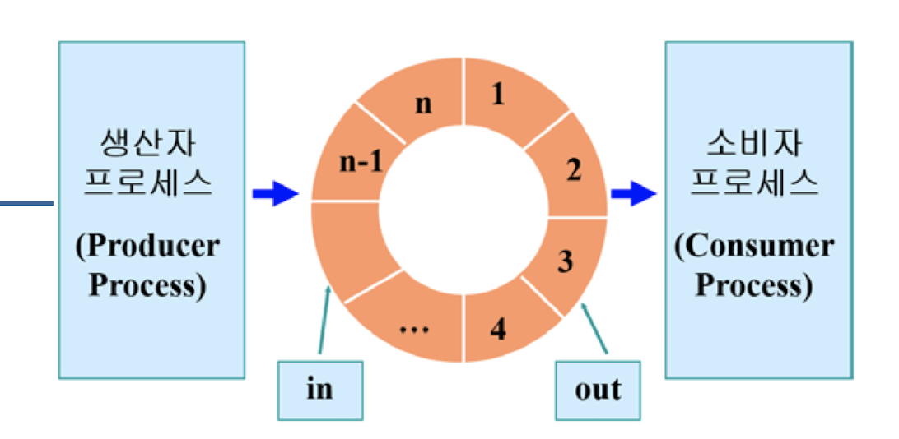

# Chapter 6: Process Synchronization

## Contents
- Background
- The Critical-Section Problem (임계구역)
- Peterson's Solution
- Synchronization Hardware
- Mutex Locks 
- Semaphore
- Classic Problems of Synchronization
- Monitors
- Synchronization Examples
- Alternative Approaches

## Objectives
- 프로세스 동기화 컨셉 제시
- critical-section problem 임계구역 문제에 대해 알아보기. 공유된 데이터에 대한 일치를 보장해줄 수 있음. 
- 소프트웨어와 하드웨어에서의 critical-section problem 의 솔루션 제시.
- 클래식한 프로세스 동기화 문제
- 프로세스 동기화 문제를 해결하는 데 사용하는 툴 알아보기.

## Background
- Process can execute concurrently : 멀티 프로세스의 형태 -> 데이터를 공유함. 여러프로세스가 하나의 공유 데이터에 접근 할 때 문제가 생길 수 있음.
  - 프로세스들은 아무 때나 interrupt 될 수 있고 부분적으로 실행이 완료될 수 있음. 
- 공유된 데이터에 대한 동시적인 접근이 데이터가 불일치함을 초래할 수 있다. 
- 데이터의 일치를 유지하려면 협력하는 프로세스들의 순차적인 실행을 보장하는 메카니즘이 필요함.


### Producer
```
  while(true){
    /* produce an item in next produced */ 
    while(counter == BUFFER_SIZE);
      /* 아무일도 하지 않음 */
    buffer[in] = next_produced;
    in = (in + 1) % BUFFER_SIZE;
    counter++;
  }
```

### Consumer
```
  while(true){
    while(counter == 0)
    /* 아무일도 하지 않음 */
    next_consumed = buffer[out];
    out = (out + 1)%BUFFER_SIZE;
    counter--;
    /* consume the item in next consumed */
  }
```

