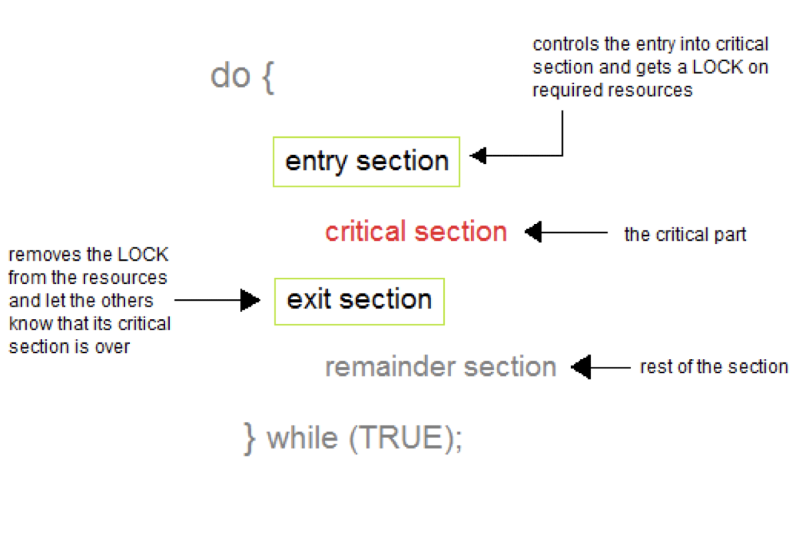
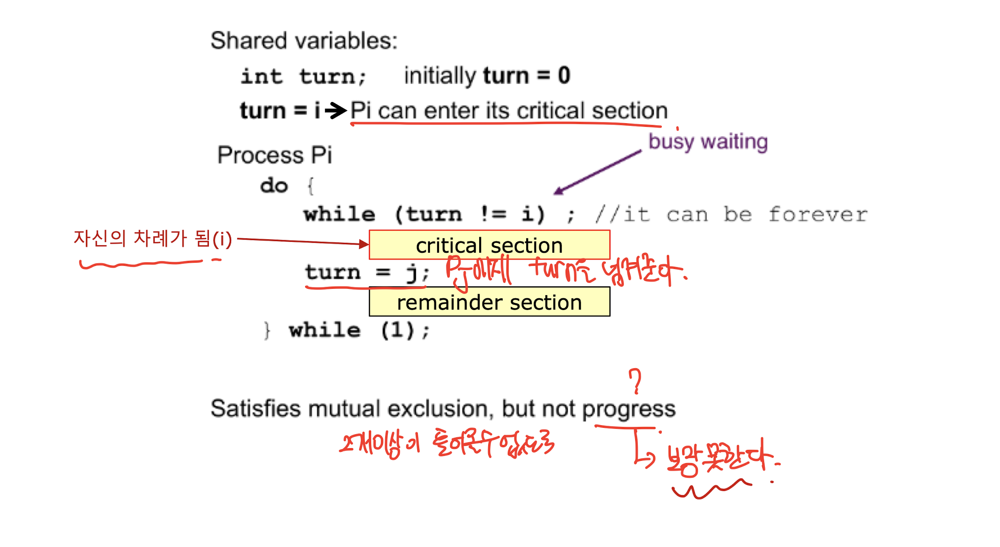
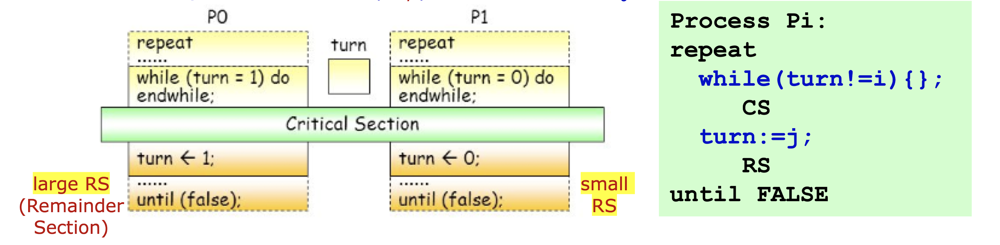
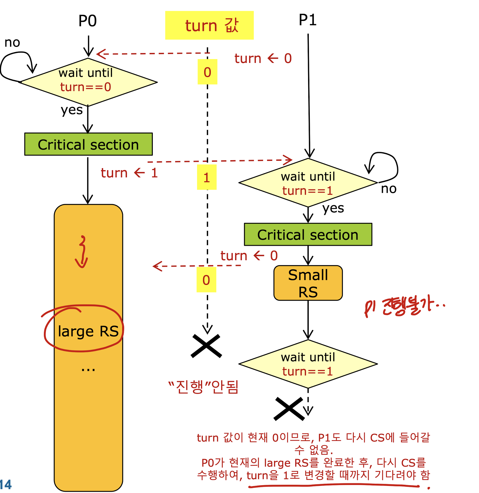
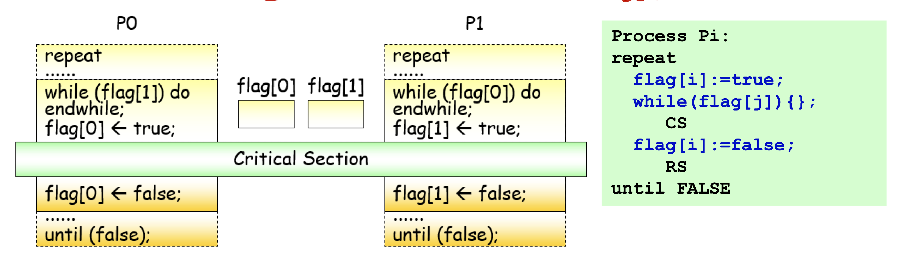
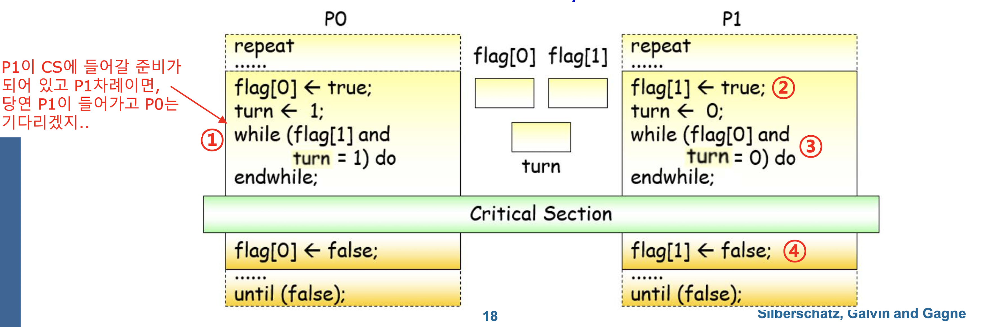

# Chapter 6: Process Synchronization

## Contents
- Background
- The Critical-Section Problem (임계구역)
- Peterson's Solution
- Synchronization Hardware
- Mutex Locks 
- Semaphore
- Classic Problems of Synchronization
- Monitors
- Synchronization Examples
- Alternative Approaches

## Objectives
- 프로세스 동기화 컨셉 제시
- critical-section problem 임계구역 문제에 대해 알아보기. 공유된 데이터에 대한 일치를 보장해줄 수 있음. 
- 소프트웨어와 하드웨어에서의 critical-section problem 의 솔루션 제시.
- 클래식한 프로세스 동기화 문제
- 프로세스 동기화 문제를 해결하는 데 사용하는 툴 알아보기.

## Background
- Process can execute concurrently : 멀티 프로세스의 형태 -> 데이터를 공유함. 여러프로세스가 하나의 공유 데이터에 접근 할 때 문제가 생길 수 있음.
  - 프로세스들은 아무 때나 interrupt 될 수 있고 부분적으로 실행이 완료될 수 있음. 
- 공유된 데이터에 대한 동시적인 접근이 데이터가 불일치함을 초래할 수 있다. 
- 데이터의 일치를 유지하려면 협력하는 프로세스들의 순차적인 실행을 보장하는 메카니즘이 필요함.


### Producer
```
  while(true){
    /* produce an item in next produced */ 
    while(counter == BUFFER_SIZE); // 사용할 수 있는 버퍼가 없으면 아무 일도 하지 않음.
      /* 아무일도 하지 않음 */
    buffer[in] = next_produced; // next 항목을 생성한 후에 버퍼에 씀.
    in = (in + 1) % BUFFER_SIZE; 
    counter++;
  }
```

### Consumer
```
  while(true){
    while(counter == 0) // 모든 버퍼가 비어있으면 아무 일도 하지 않음 
    /* 아무일도 하지 않음 */
    next_consumed = buffer[out]; // 버퍼에서 read 함
    out = (out + 1)%BUFFER_SIZE;
    counter--;
    /* consume the item in next consumed */
  }
```


### 문제 설명

producer : 데이터를 버퍼에 씀. 


consumer : 버퍼에서 데이터를 읽음.


여기서 counter로 차있는 버퍼의 개수를 계속해서 추적함.
처음에, counter는 0으로 세팅되어 있음. producer가 새로운 버퍼를 생성하면 counter를 증가시키고, consumer가 버퍼에 있는 값을 읽고는 counter를 감소시킨다.

### Race Condition 발생
- counter++
```
register1 = counter
register1 = register1 + 1
counter = register1
```
counter는 메모리 상의 변수로, cpu내부에 있는 register에 counter 변수를 불러와서 증가시킨 뒤, 다시 counter에 넣어준다. 
- counter--
```
register2 = counter
register2 = register2 - 1
couter = register2
```
cpu의 레지스터에 counter 를 불러온 뒤, 값을 감소시키고 그 값을 다시 counter 에 넣어줌.

- 카운터를 증가시기고 감소시키는 두 프로세스가 독립적으로 존재한다고 가정하고, 각각의 프로세스 동시에 counter 변수에 접근하게 되면 counter의 값을 보장할 수 없어진다. 문제상황은 다음과 같다.
처음 카운터 값을 5라고 가정한다. 

1. s0: p : register1 = counter => register1 = 5
2. s1: p : register1 = register1 + 1 => register1 = 6
3. s2: c : register2 = counter => register2 = 5
4. s3: c : register2 = register2 - 1 => register2 = 4
5. s4: p : counter = register1 => counter = 6 
6. s5: c : counter = register2 => counter = 4
 
- 원하는 바에 따르면 카운터의 값은 5가 되어야 한다. 이렇게 몇몇의 프로세스가 같은 데이터를 동시에 접근하거나 바꿔버리면 결과가 특정 접근 순서에 따라 바뀌는 것을 race condition이라고 한다. 프로세스나 thread의 실행 순서에 의해 결과가 달라지므로 프로세스 동기화가 필요하다.


## Critical Section Problem
- 시스템이 n개의 프로세스로 되어있다고 가정하자.
- 각각의 프로세스는 critical section이라는 코드 세그먼트를 가진다. 
  - 임계구역 내에서 : 프로세스는 공유된 변수를 바꾸거나, 테이블을 업데이트하거나, 파일을 읽는 등의 동작을 한다. 
  - 임계구역의 중요한 특징 : _**하나의 프로세스가 임계구역에 있으면, 다른 프로세스는 임계구역에 있을 수 없다.**_
  (반드시 하나의 프로세스만이 그 프로세스의 임계구역에 존재할 수 있다는 의미.)
- **Critical Section Problem**
  - Critical Section Problem은 프로세스들의 액티비티를 동기화하고 협력적으로 데이터를 공유하기 위해 프로토콜을 설계하는 것이다. 
- 각각의 프로세스는 **진입구역(entry section)** 과 **퇴출구역(exit section)** 그리고 **나머지구역(remainder section)** 으로 되어있다. 프로세스는 critical section에 진입하기 위해 진입구역에서 허락을 구해야한다.

## Critical Section
- **Critical Section** 은 공유된 변수에 접근하고 atomic한 action으로 실행되어야 하는 코드 세그먼트이다. 
  - 협력하는 프로세스들의 집합에서 한 시접에 하나의 프로세스만이 그 프로세스의 임계구역에 있을 수 있다는 의미이다. 
  - 만약에 다른 프로세스가 그 프로세스의 임계구역을 실행 하고 싶으면, 현재 임계구역에 있는 프로세스가 끝날 때 까지 기다려야 한다. 
  ### 진입구역(entry section)
  임계구역에 진입하기 위해 허용을 요구하는 코드 세그먼트

  ### **임계구역(Critical Seciton)**
  다른 프로세스와 공유하고 있는 변수를 접근 변경하거나 테이블을 갱신, 파일을 쓰는 등의 동작을 수행함. atomic하게 동작해야함.

  ### 퇴출구역(exit section)
  임계구역 다음에 나오는 영역으로써, 임계구역을 벗어나기 위한 코드 세그먼트

  ### 나머지구역(remainer section)
  프로그램의 나머지코드 부분

  프로세스의 일반적인 구조는 다음과 같다.
  

  

  turn 이라는 변수를 공유하고 이 변수는 처음에 0으로 초기화 된다. turn 이 i가 되면 Pi가 임계구역에 진입할 수 있다. 임계구역 실행을 마치고, turn을 j로 바꿔줌으로써 본인은 임계구역에서 벗어나 다음 코드를 실행하고 Pj라는 다른 프로세스가 임계구역에 진입할 수 있어진다. 이 알고리즘은 Mutual Exclusion을 만족하지만 Progress를 만족하지 못한다. 

  Critical section problem 솔루션은 다음 3가지의 조건을 만족해야 한다. 
  1. Mutual Exclusion
  2. Progress
  3. Bounded Waiting

## Solution to Critical-Section Problem
### 1. Mutual Exclusion (상호배제)
- Pi가 임계구역을 실행하고 있으면 다른 프로세스는 임계구역 내의 코드를 실행시킬 수 없다. 
### 2. Progress (진행)
- 만약 임계구역 내 코드를 실행하고 있는 프로세스가 없고 임계구역에 진입하고 싶은 몇몇의 프로세스들이 존재한다면, 이들 모두가 진입하기 위해 무한정 기다려서는 안된다.
- Deadlock avoidance 가 필요.
### 3. Bounded Waiting (한계대기)
- 현재 어떤 프로세스가 임계구역 진입을 요청한 후, 그 프로세스는 진입이 허용될 때까지 기다리고 있는다. 이때, 다른 프로세스들이 임계구역에 진입하는 횟수 또는 시간에 있어서 제한이 있어야 한다. 그렇지 않으면 그 프로세스는 계속 임계구역에 진입하지 못하게 되러 Starvation이 유발된다. 

## Critical-Seciton Handling in Os
- software solution
  - 정확도가 어떠한 가정, 추정에 의지하지 않음.
- hardware solution
  - 특정한 기계 명령에 의지.
- Os solution
  - os는 프로그래머에게 함수와 data structure를 제공함.

  ### 2가지 접근방식 : 커널의 선점? 비선점?
  - Non-preemptive kernel : 특정 순간에 커널 내에서 실행되는 프로세스가 하나밖에 없으므로 race condition 이 발생하지 않음.
  - Preemptive kernel : Race condition 이 발생이 가능해서, race condition이 발생하지 않도록 설계되어야 한다. 

## Software solution

- Process 가 2개가 있는 경우
  - 두개의 프로세스 : P0, P1
  - 알고리즘 1, 2  => 틀림
  - 알고리즘 3 => 맞음 : **Peterson's algorithm**

- n개의 process
  - **bakery algorithm**

  ### Algorithm 1 
  - 공유된 변수 turn 이 0 또는 1로 초기화.
  - Pi의 임계구역은 turn이 1일때 수행.
  - Pj가 임계구역에 있는 상태에서 Pi은 _busy waiting_ 상태임. : mutual exclusion 만족
  - __하지만 이 기법은 Progress requirement를 만족시킬 수 없음__
  - 예시)
    
    여기서 p0가 large RS를 가지고 있고, p1은 small RS를 가지고 있음. 
    
    turn이 0이면 p0은 CS에 진입하고 그 후 RS에 진입. 이때 turn =1. p1이 CS 와 RS에 진입한구(turn 다시 0) 다시 CS로 들어가려고 하면 request가 refused됨. p1은 p0가 RS를 모두 끝낼 때 까지 기다려야 하기 떄문임. turn 이 1이 되기 위해서는 p0 가 cs수행을 해야하는데, p0는 이전 cs 진입 후에 아직도 큰 RS를 수행하고 있음. 이미 turn은 0으로 ㅇ변경된 상태임, 이때 p0가 cs 진입 후, turn을 1로 바꿔줘야 p1의 cs로 들어갈 수 있는데 불가능한 상황임.

    ### __=> Progress requirement is not satisfied__

    

  ### Algorithm 2
  - Boolean 타입의 변수를 각각의 프로세스에 가지고 있음. : flag[0], flag[1]
  - pi 시그널 : CS에 들어갈 준비중임 : flag[i] = true (Pi가 cs에 들어가고 싶다고 깃발드는 것)
  - Mutual Exclusion 이 만족, 하지만 Progress requirement는 만족하지 못함.
  - 만약 flag[0] = true, flag[1] = true 이면 두 프로세스는 영원히 cs에 진입할 수 없음 => __DEADLOCK__

  

  두 flag가 모두 true로 시작하면, 두 프로세스는 위의 그림에서 보는 것과 같이 while문을 벗어날 수 없다. 그래서 서로 물고 물리는 관계가 되어 deadlock이 발생한다. 그래서 이 알고리즘은 progress 조건을 만족할 수 없다.

  ### Algorithm 3 __Peterson's Solution__
  - 2개의 프로세스를 위한 솔루션이다. 
  - __load__ 와 __store__ 기계어 명령어가 atomic하다고 가정한다. : interrupt 될 수 없음을 의미.
  - 2개의 프로세스는 2개 변수를 공유한다. 
    - _int turn_
    - _Boolean flag[2]_
  - turn이라는 변수는 cs에 들어갈 프로세스의 차례를 말한다. 
  - flag 배열은 임계구역에 들어갈 준비가 되어있는 프로세스를 나타낸다. flag[i] = true : Pi is ready!

    ### Algorithm for Process Pi
    - Initialization : flag[0], flag[1] => flase, turn 은 0 또는 1
    - 만약 두개 프로세스 모두 동시에 cs 에 진입하고자 하면, turn에 의해서 하나의 프로세스가 cs에 진입 가능.
      - cs에 진입하기 위해 p0은 flag[0]=1, turn=1로 지정 : p0도 cs에 들어가고 싶지만, turn이 1이므로 p1에게 cs에 들어가고 싶으면 들어가라는 의미. 
      - p1의 while문에서 turn=1이 되면 p1은 cs 진입.
    - Exit section : Pi는 cs에 진입하고 싶지 않음을 나타냄. 깃발을 내림. flag[i] = false

    
  - Mutual exclusion 만족 : flag[0] = flag[1] = true는 p0과 p1이 cs에 들어가고자 하는 의도가 있음을 의미하고, turn이 i일때 pi가 cs에 진입함.
  - Progress 와 Bounded waiting requirements 만족 
    - while(flag[j]==true&& turn == j) 로 인해 Pi가 cs영역에 진입할 수 없음. 만약 pj가 진입준비가 되어있지 않거나 (flag[j]<-false) 혹은 j가 들어갈 순서가 아니면(turn!=j) i가 while문을 벗어나서 cs진입이 가능해짐.
    - Pj는 flag[j]<-true로 하고 cs를 진입하고자 기다린다. 이때 turn ==i이라면 Pi의 cs영역으로 진입하고 turn ==j 이면 Pj의 cs 영역에 진입한다. Pj는 cs영역 실행 후에 flag[j]<-false로 지정하여 cs에서 나왔다는 것을 알린다. 이러면 상대방 pi가 바로 cs에 진입을 가능하게 만들어준다. 
    - Pj는 cs에 들어가고 싶어 flag[j]<-true로 지정하지만 turn 값을 오히려 i로 지정해 다른 프로세스에게 양보한다.
    - Pi는 while문에서 기다리는 동안 turn값 j를 바꾸지 않으므로 상대방 Pj는 cs진입이 보장된다. Pj가 cs에 들어갔다 나오면 다시 들어가지 않는다. 그러므로 Pi도 한번은 cs 진입이 보장된다고 할 수 있다. 


