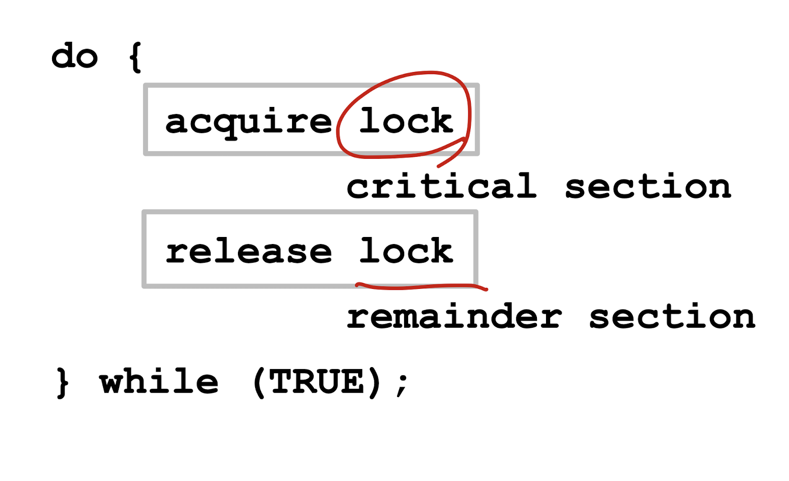

## Synchronization Hardware
- 많은 시스템은 critical section code를 실행하기 위한 hardware support를 제공한다.
- 모든 솔루션은 Locking에 기반. : lock을 통해 임계 지역을 보호.
- Uniprocessors 는 interrupt를 disable할 수 있음.
  - 현재 수행하는 코드는 preemption없이 실행할 것임.
  - 일반적으로 멀티프로세서 시스템에서는 너무나 비효율적인 방법.
    - 멀티프로세서에서는 mutual exclusion도 보장이 되지 않고, interrupt를 disable시키는 것은 솔루션이 될 수 없다.
- Modern machines은 특별한 atomic hardware instruction을 제공한다. atomic == non-interruptible
  - example
    - test memory word and set value
    - swap contents of two memory words




## test_and_set Instruction 
```
boolean test_and_set(boolean *target)
{
  boolean rv = *target;
  *target  = TRUE;
  return rv;
}
```
- test : target 주소 메모리 값을 확인함.
- set : target 주소에 해당하는 메모리 값을 true로 setting.
- atomic하게 동작.
- 넘겨받은 매개변수의 원래 값을 리턴.
- 넘겨받은 매개변수를 새로운 값으로 세팅 (TRUE 로)


- 공유된 불리언 변수 lock은 false로 초기화 됨.
```
do{
  while(test_and_set(&lock)){ // lock은 프로세스간 공유된 값, 초기에 false. 이때 while을 벗어나 cs 진입가능함. 나중에 lock을 true로 세팅하여 while에 남도록함. 
    /* 아무일도 없음 */
  }
  /*critical section*/
  lock = false; // cs를 떠날 때, lock을 false로 세팅해 다른 프로세스가 cs에 진입할 수 있도록 해줌.
  /*remainder section*/
}while(true);
```

## compare_and_swap Instruction
``` 
int compare_and_swap(int * value, int expected, int new_value){
  int temp = *value;
  if(*value == expected)
    *value = new_value;
  return temp;
}
```
- compare: 해당 주소의 값이 expected와 같으면 swap: 새로운 값으로 바꿈.
- atomic하게 동작.
- 공유된 integer lock은 0으로 초기화.
```
do {
  while(compare_and_swap(&lock, 0, 1) !=0){
    ; /* do nothing */
  }
  /* critical section */
  lock = 0;
  /* remainder section */
}while(true)
```

- lock의 값이 1이면 계속 기다림
- lock 값이 expected 즉, 0과 같으면 while문 나와서 cs 진입.
- 진입하자마자 다른 진입 막기위해서 new value 를 1로 바꿈 
- Bounded Waiting 만족 못함.

## Bounded-waiting Mutual Exclusion with test_and_set
- boolean waiting[n]
- boolean lock;
- 모두 false 로 초기화 
- Pi가 waiting, key가 true인 상태, cs 진입하기 위해 test_and_set을 체크함.
- lock이 false 값이면, (다른 프로세스에 의해 lock되어 있지 않은 상태, 아무도 cs 에 없는 상태.) key가 false가 되어 cs에 진입.
- 자신은 cs에 진입하고, lock을 1로 세팅해서 다른 프로세스의 진입을 막는다.
- cs영역 진입후에, 자신의 waiting 을 false로 바꾸어 waiting 하지 않음을 알린다.
- cs에서 나오면서 다른 pj 상태를 i+1, ... , i-1까지 순환하면서 체크
- waiting 하는 j가 있으면 해당 j waiting을 false로 바꿔준 다음, 해당 pj가 cs에 진입가능하도록 하고, 이 pj가 cs에 진입할 수 있도록 lock을 풀어준다.
=> Bounded waiting requirement is satisfied (한정된 대기 조건 만족. 한 프로세스가 cs을 실행한 후에 반드시 다른 프로세스가 적어도 한번은 cs에 진입할 수 있으므로)

```
do{
  waiting[i] = true;
  key = true;
  while(waiting[i] && key ) key = test_and_set(&lock);
  waiting[i] = false;
  /* critical section */
  j = (i+1)%n;
  while((j!=i) && !waiting[j])
    j = (j+1)%n;
  if(j==i)
    lock = false;
  else
    waiting[j] = false;
  /* remainder section */ 
}while(true);
```


## Mutex Locks
- 이전의 솔루션들은 복잡하고 일반적으로 프로그래머들이 응용하기에는 힘들다.
- Os 설계자가 critical section problem을 해결할 툴을 개발한다. 
- Mutex lock이 가장 단순하다.
- Critical section을 acquire()를 통해 lock을 가져오고 release()를 통해 lock을 푸는 것으로 보호한다.
- acquire() 와 release()는 atomic하게 동작해야만 한다. (대게 하드웨어 atomic 명령어로 실행된다.)
- 하지만 이 솔루션은 _busy waiting_ 이 필요하다. 그래서 이 lock은 spinlock이라고도 불린다. 

## 

```
acquire(){
  while(!available)
    ; /* busy waiting */
  available = false;
}
release(){
  available = true;
}

do{
  acquire lock
    critical section
  release lock
    remainder section
}while(true);
```
- acquire() : lock 획득
- release() : lock 반환
- mutex lock은 available 이라는 불리언 타입의 변수를 가짐. 


